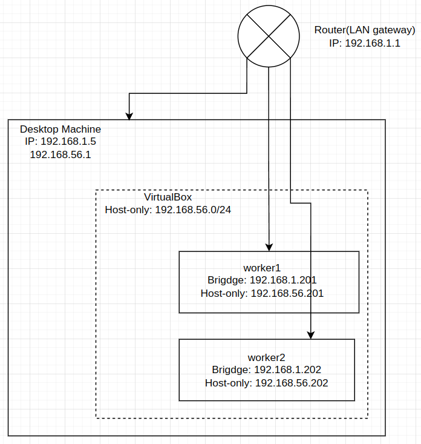

## Follow kubernetes the hard way aws
[github](https://github.com/techiescamp/kubernetes-projects/blob/main/01-kubernetes-the-hard-way-aws/docs)

With two virtualbox machine running ubuntu24.04 server
- Local LAN IP range: `192.168.1.0/24`
- Host-only network IPv4 Prefix: `192.168.56.1/24`


### Enable virtual machine network interface
ubuntu24.04
- Adapter 1: bridged
- Adapter 2: host-only

`sudo ip link enp0s8 up`

/etc/netplan/[xxx]
```
network:
    ethernets:
        enp0s3: # bridged
            addresses:
              - 192.168.1.201/24
            routes:
              - to: 0.0.0.0/0
                via: 192.168.1.9
        enp0s8: # host-only
            addresses:
              - 192.168.56.201/24
            routes:
              - to: 192.168.56.0/24
                via: 192.168.56.1
    version: 2
```
### Check service error
```
journalctl -xeu etcd.service
journalctl -u etcd.service -f
journalctl -u kube-apiserver.service -f
journalctl -u kube-controller-manager.service -f
```
### Machine
|name|type|public IP|internal IP|
|-|-|-|-|
|host|control|192.168.1.4|192.168.56.1|
|worker-1|node|192.168.1.201|192.168.56.201|
|worker-2|node|192.168.1.202|192.168.56.202|

### Pem keys and certs
1. bash-kubelet-client-certificates.sh

```bash
for i in 0 1 2; do
    instance_hostname="ip-192-168-56-20${i}"
    instance=${instance_hostname}
    cat > ${instance}-csr.json <<EOF
{
"CN": "system:node:${instance_hostname}",
"key": {
    "algo": "rsa",
    "size": 2048
},
"names": [
    {
    "C": "US",
    "L": "Portland",
    "O": "system:nodes",
    "OU": "Kubernetes The Hard Way",
    "ST": "Oregon"
    }
]
}
EOF

    external_ip="192.168.1.20${i}"

    internal_ip="192.168.56.20${i}"

    cfssl gencert \
        -ca=ca.pem \
        -ca-key=ca-key.pem \
        -config=ca-config.json \
        -hostname=${instance_hostname},${external_ip},${internal_ip} \
        -profile=kubernetes \
        ${instance}-csr.json | cfssljson -bare ${instance}
done
```

1. bash-kubernetes-api-server-certificates.sh
    ```bash
    KUBERNETES_HOSTNAMES=kubernetes,kubernetes.default,kubernetes.default.svc,kubernetes.default.svc.cluster,kubernetes.svc.cluster.local
    KUBERNETES_PUBLIC_ADDRESS=k8s.local

    cat > kubernetes-csr.json <<EOF
    {
    "CN": "kubernetes",
    "key": {
        "algo": "rsa",
        "size": 2048
    },
    "names": [
        {
        "C": "US",
        "L": "Portland",
        "O": "Kubernetes",
        "OU": "Kubernetes The Hard Way",
        "ST": "Oregon"
        }
    ]
    }
    EOF

    cfssl gencert \
    -ca=ca.pem \
    -ca-key=ca-key.pem \
    -config=ca-config.json \
    -hostname=10.32.0.1,192.168.56.1,192.168.56.200,192.168.56.201,192.168.56.202,${KUBERNETES_PUBLIC_ADDRESS},127.0.0.1,${KUBERNETES_HOSTNAMES} \
    -profile=kubernetes \
    kubernetes-csr.json | cfssljson -bare kubernetes
    ```

1. bash-kubelet-kubernetes-configuration-file.sh
    ```bash
    KUBERNETES_PUBLIC_ADDRESS=k8s.local

    for i in 0 1 2; do
    instance_hostname="ip-192-168-56-20${i}"
    instance=${instance_hostname}

    kubectl config set-cluster kubernetes-the-hard-way \
        --certificate-authority=ca.pem \
        --embed-certs=true \
        --server=https://${KUBERNETES_PUBLIC_ADDRESS}:6443 \
        --kubeconfig=${instance}.kubeconfig
    
    kubectl config set-credentials system:node:${instance_hostname} \
        --client-certificate=${instance}.pem \
        --client-key=${instance}-key.pem \
        --embed-certs=true \
        --kubeconfig=${instance}.kubeconfig
    
    kubectl config set-context default \
        --cluster=kubernetes-the-hard-way \
        --user=system:node:${instance_hostname} \
        --kubeconfig=${instance}.kubeconfig
    
    kubectl config use-context default --kubeconfig=${instance}.kubeconfig
    done
    ```

1. bash-kube-proxy-kubernetes-configuration-file.sh
    ```bash
    KUBERNETES_PUBLIC_ADDRESS=k8s.local

    kubectl config set-cluster kubernetes-the-hard-way \
    --certificate-authority=ca.pem \
    --embed-certs=true \
    --server=https://${KUBERNETES_PUBLIC_ADDRESS}:6443 \
    --kubeconfig=kube-proxy.kubeconfig

    kubectl config set-credentials system:kube-proxy \
    --client-certificate=kube-proxy.pem \
    --client-key=kube-proxy-key.pem \
    --embed-certs=true \
    --kubeconfig=kube-proxy.kubeconfig

    kubectl config set-context default \
    --cluster=kubernetes-the-hard-way \
    --user=system:kube-proxy \
    --kubeconfig=kube-proxy.kubeconfig

    kubectl config use-context default --kubeconfig=kube-proxy.kubeconfig
    ```

### Bootstraping etcd
1. cert
    ```bash
    cd /etc/etcd
    ln -s ~/temp/k8s/ca.pem ca.pem
    ln -s ~/temp/k8s/kubernetes.pem kubernetes.pem
    ln -s ~/temp/k8s/kubernetes-key.pem kubernetes-key.pem
    ```

1. link etcd binaray to `/usr/local/bin`
    ```bash
    sudo ln -s /home/jack/Code/go/etcd/bin/etcd /usr/local/bin/etcd
    ```

1. bash-create-etcd-service.sh
    ```bash
    ETCD_NAME=etcd-host-name
    INTERNAL_IP=192.168.56.1

    cat <<EOF | sudo tee /etc/systemd/system/etcd.service
    [Unit]
    Description=etcd
    Documentation=https://github.com/coreos

    [Service]
    Type=notify
    ExecStart=/usr/local/bin/etcd \\
    --name ${ETCD_NAME} \\
    --cert-file=/etc/etcd/kubernetes.pem \\
    --key-file=/etc/etcd/kubernetes-key.pem \\
    --peer-cert-file=/etc/etcd/kubernetes.pem \\
    --peer-key-file=/etc/etcd/kubernetes-key.pem \\
    --trusted-ca-file=/etc/etcd/ca.pem \\
    --peer-trusted-ca-file=/etc/etcd/ca.pem \\
    --peer-client-cert-auth \\
    --client-cert-auth \\
    --initial-advertise-peer-urls https://${INTERNAL_IP}:2380 \\
    --listen-peer-urls https://${INTERNAL_IP}:2380 \\
    --listen-client-urls https://${INTERNAL_IP}:2379,https://127.0.0.1:2379 \\
    --advertise-client-urls https://${INTERNAL_IP}:2379 \\
    --initial-cluster-token etcd-cluster-0 \\
    --initial-cluster controller-0=https://192.168.56.1:2380 \\
    --initial-cluster-state new \\
    --data-dir=/home/jack/Code/go/etcd/bin/default.etcd
    Restart=on-failure
    RestartSec=5

    [Install]
    WantedBy=multi-user.target
    EOF
    ```

### Configure the kubernetes api server
1. cert
    ```bash
    origin_path=/home/jack/temp/k8s
    target_path=/var/lib/kubernetes
    for thefile in ca.pem ca-key.pem kubernetes-key.pem kubernetes.pem service-account-key.pem service-account.pem encryption-config.yaml; do
    ln -s "${origin_path}/${thefile}" "${target_path}/${thefile}"
    done
    ```
1. bash-create-kube-apiserver-service.sh 
```bash
INTERNAL_IP=192.168.56.1
KUBERNETES_PUBLIC_ADDRESS=k8s.local
ETCD_SERVER=192.168.56.1

cat <<EOF | sudo tee /etc/systemd/system/kube-apiserver.service
[Unit]
Description=Kubernetes API Server
Documentation=https://github.com/kubernetes/kubernetes

[Service]
ExecStart=/usr/local/bin/kube-apiserver \\
--advertise-address=${INTERNAL_IP} \\
--allow-privileged=true \\
--apiserver-count=3 \\
--audit-log-maxage=30 \\
--audit-log-maxbackup=3 \\
--audit-log-maxsize=100 \\
--audit-log-path=/var/log/audit.log \\
--authorization-mode=Node,RBAC \\
--bind-address=0.0.0.0 \\
--client-ca-file=/var/lib/kubernetes/ca.pem \\
--enable-admission-plugins=NamespaceLifecycle,NodeRestriction,LimitRanger,ServiceAccount,DefaultStorageClass,ResourceQuota \\
--etcd-cafile=/var/lib/kubernetes/ca.pem \\
--etcd-certfile=/var/lib/kubernetes/kubernetes.pem \\
--etcd-keyfile=/var/lib/kubernetes/kubernetes-key.pem \\
--etcd-servers=https://${ETCD_SERVER}:2379 \\
--event-ttl=1h \\
--encryption-provider-config=/var/lib/kubernetes/encryption-config.yaml \\
--kubelet-certificate-authority=/var/lib/kubernetes/ca.pem \\
--kubelet-client-certificate=/var/lib/kubernetes/kubernetes.pem \\
--kubelet-client-key=/var/lib/kubernetes/kubernetes-key.pem \\
--runtime-config='api/all=true' \\
--service-account-key-file=/var/lib/kubernetes/service-account.pem \\
--service-account-signing-key-file=/var/lib/kubernetes/service-account-key.pem \\
--service-account-issuer=https://${KUBERNETES_PUBLIC_ADDRESS}:6443 \\
--service-cluster-ip-range=10.32.0.0/24 \\
--service-node-port-range=30000-32767 \\
--tls-cert-file=/var/lib/kubernetes/kubernetes.pem \\
--tls-private-key-file=/var/lib/kubernetes/kubernetes-key.pem \\
--v=2
Restart=on-failure
RestartSec=5

[Install]
WantedBy=multi-user.target
EOF
```

### Configure the Kubernetes Controller Manager
1. copy file
    ```
    sudo ln -s /home/jack/temp/k8s/kube-controller-manager.kubeconfig /var/lib/kubernetes/kube-controller-manager.kubeconfig
    ```

### Configure the Kubernetes Scheduler
1. copy file
    ```
    sudo ln -s /home/jack/temp/k8s/kube-scheduler.kubeconfig /var/lib/kubernetes/kube-scheduler.kubeconfig
    ```
1. `kube-scheduler.yaml`
    ```bash
    cat <<EOF | sudo tee /etc/kubernetes/config/kube-scheduler.yaml
    apiVersion: kubescheduler.config.k8s.io/v1
    kind: KubeSchedulerConfiguration
    clientConnection:
    kubeconfig: "/var/lib/kubernetes/kube-scheduler.kubeconfig"
    leaderElection:
    leaderElect: true
    EOF
    ```

### Add Host File Entries
1. append to `/etc/hosts`
```bash
cat <<EOF | sudo tee -a /etc/hosts
192.168.56.200 ip-192-168-56-200
192.168.56.201 ip-192-168-56-201
192.168.56.202 ip-192-168-56-202
EOF
```

### The Admin Kubernetes Configuration File
```bash
KUBERNETES_PUBLIC_ADDRESS=k8s.local

kubectl config set-cluster kubernetes-the-hard-way \
  --certificate-authority=ca.pem \
  --embed-certs=true \
  --server=https://${KUBERNETES_PUBLIC_ADDRESS}:6443

kubectl config set-credentials admin \
  --client-certificate=admin.pem \
  --client-key=admin-key.pem

kubectl config set-context kubernetes-the-hard-way \
  --cluster=kubernetes-the-hard-way \
  --user=admin

kubectl config use-context kubernetes-the-hard-way
```